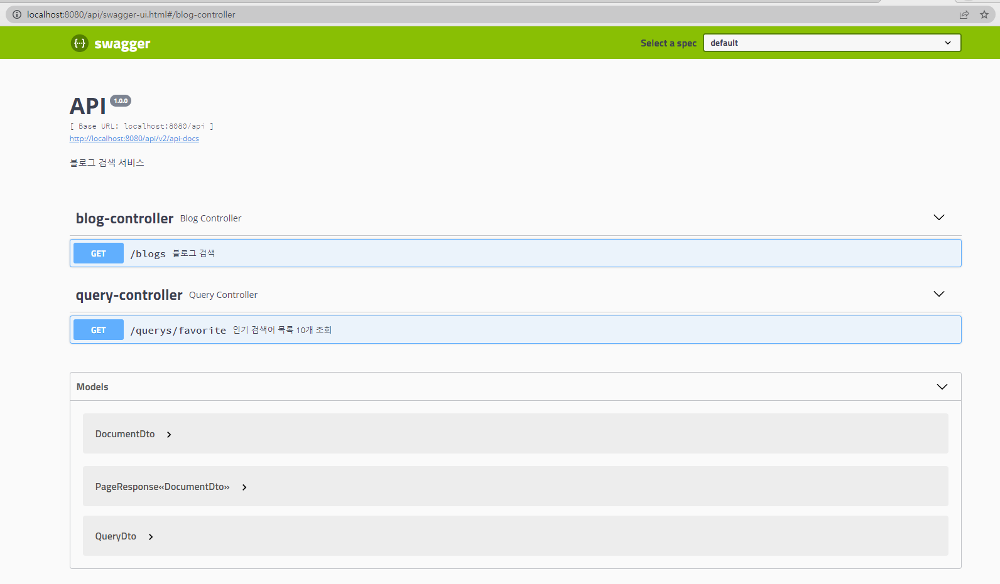

## 프로젝트 소개
- 오픈 API를 이용한 블로그 검색 서비스
---

## API 명세
### GET /api/blogs
- 설명
  - 블로그를 검색하는 API입니다.
  - 원하는 검색어와 함께, 결과 형식 파라미터를 추가하여 블로그를 조회할 수 있습니다.
- 쿼리 파라미터
  - query (required) : 검색을 원하는 질의어</br>특정 블로그 글만 검색하고 싶은 경우, 블로그 url과 검색어를 공백(' ') 구분자로 넣을 수 있음
  - sort (optional) : 결과 문서 정렬 방식, accuracy(정확도순) 또는 recency(최신순), 기본 값 accuracy
  - page (optional) : 결과 페이지 번호, 1~50 사이의 값, 기본 값 1
  - size (optional) : 한 페이지에 보여질 문서 수, 1~50 사이의 값, 기본 값 10
- 응답 구조
  - page : 요청 페이지 번호
  - size : 요청 size
  - totalCount : 전체 검색 개수
  - sort : 적용된 정렬 조건
  - contents
    - blogname : 블로그의 이름 
    - contents : 블로그 글 요약
    - datetime : 블로그 글 작성시간, ISO 8601 [YYYY]-[MM]-[DD]T[hh]:[mm]:[ss].000+[tz]
    - thumbnail : 검색 시스템에서 추출한 대표 미리보기 이미지 URL, 미리보기 크기 및 화질은 변경될 수 있음
    - title : 블로그 글 제목
    - url : 블로그 글 URL

### GET /api/querys/favorite
- 설명
  - 사용자들이 많이 검색한 순서대로 최대 10개의 검색 키워드를 제공합니다.
  - 검색어 별로 검색된 횟수와 함께, 검색 횟수 내림차순으로 정렬되어 전달됩니다.
- 쿼리 파라미터
  - 없음
- 응답 구조
  - 검색어 및 검색횟수로 구성된 객체의 배열
  - query : 검색어
  - count : 검색 횟수

--- 
## 실행
a. 배포된 jar 실행
- 다음의 google drive 링크를 통해 blogsearch-1.0.0.jar 다운로드 
- https://drive.google.com/file/d/1kCB4irysRH4ZtdtyOgZXYEEDwOms_XfT/view?usp=share_link
- (크롬 시크릿 모드는 다운로드되지 않음 주의)
- 다운로드 후 아래 명령어를 통해 실행 (java 11 이상 환경 필요)
- ```shell
  java -jar blogsearch-1.0.0.jar
  ```
- 8080 포트에서 동작 (e.g. localhost:8080/api/api/querys/favorite )
- 

b. git clone 및 프로젝트 빌드 후 실행
- ```shell
  git clone https://github.com/hgbong/blogsearch.git
  
  ./gradlew clean build -x test (linux)
  gradlew clean build -x test   (windows)
  
  java -jar build/libs/blogsearch-1.0.0.jar
  ```
---

## 사용 기술 및 목적
- java: 11
- spring boot: 2.6.9
  - BOM : jpa, web, validation, webflux
- gradle: 7.6.1
- swagger: 2.9.2 
- h2: 1.4.200
  - 인메모리 DB 구축을 위해 사용
- modelmapper : 2.3.8
  - JPA Entity - DTO 변환을 위해 사용
- awaitility : 4.2.0
  - 스케줄러 비동기 테스트를 위해 사용
  - (그러나 아직 테스트 클래스 보완 필요)
---

## 구현 내용 요약
- 검색어 입력 조회 시 해당 검색어와 검색 횟수를 캐싱
- 저장해둔 검색어,검색 횟수 정보를 일정 주기마다 비동기적으로 DB에 반영
  - 현재는 1초로 설정되어 있으나, application.yml 에서 cron 변경 가능
- 검색어 DB Insert/Update 쓰레드 안정성 확보
- 검색소스 오픈 API 장애 시, 타 오픈 API를 사용하는 chain of responsibility 구조 적용
